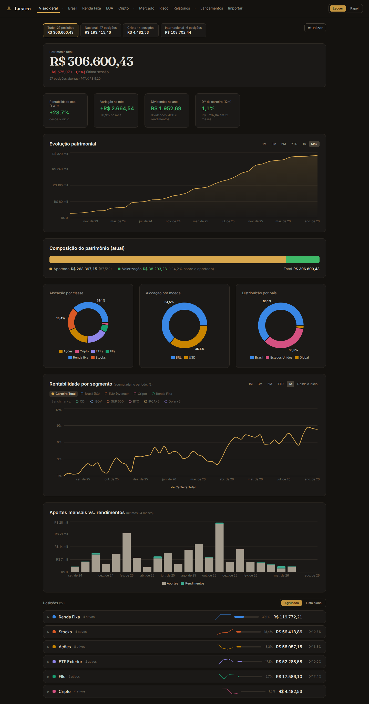
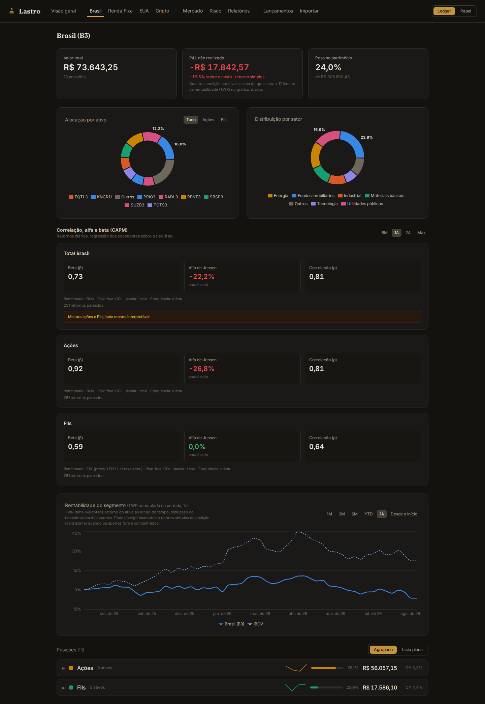
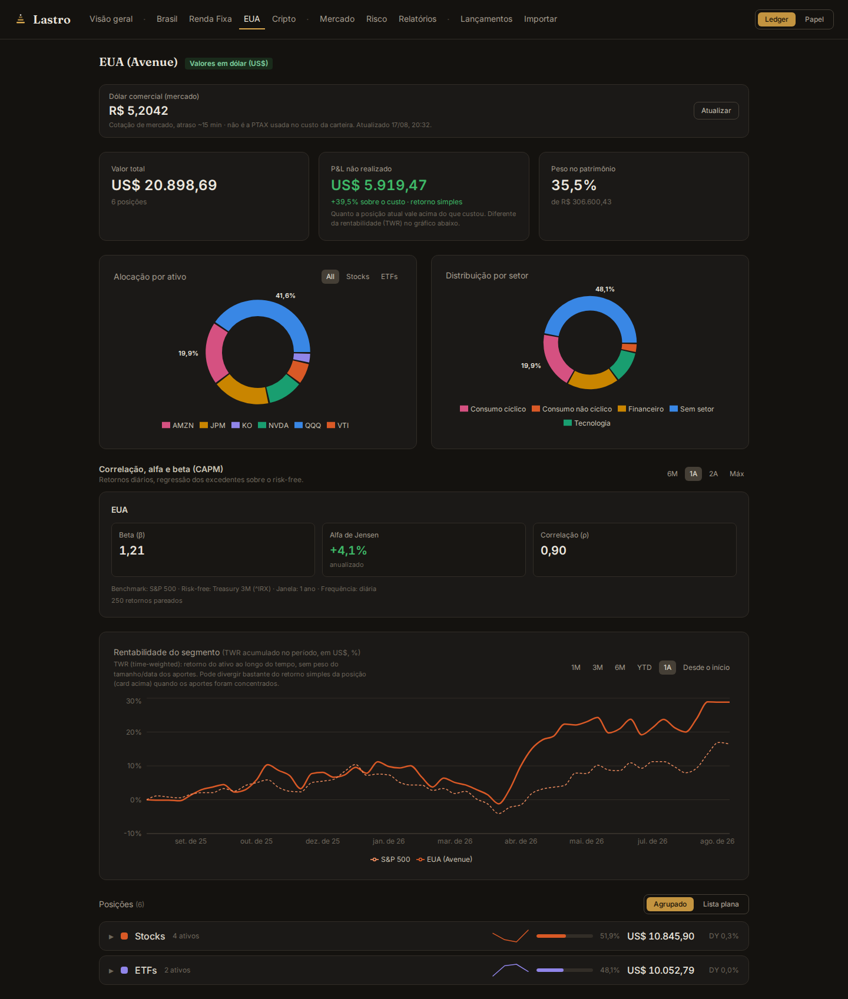
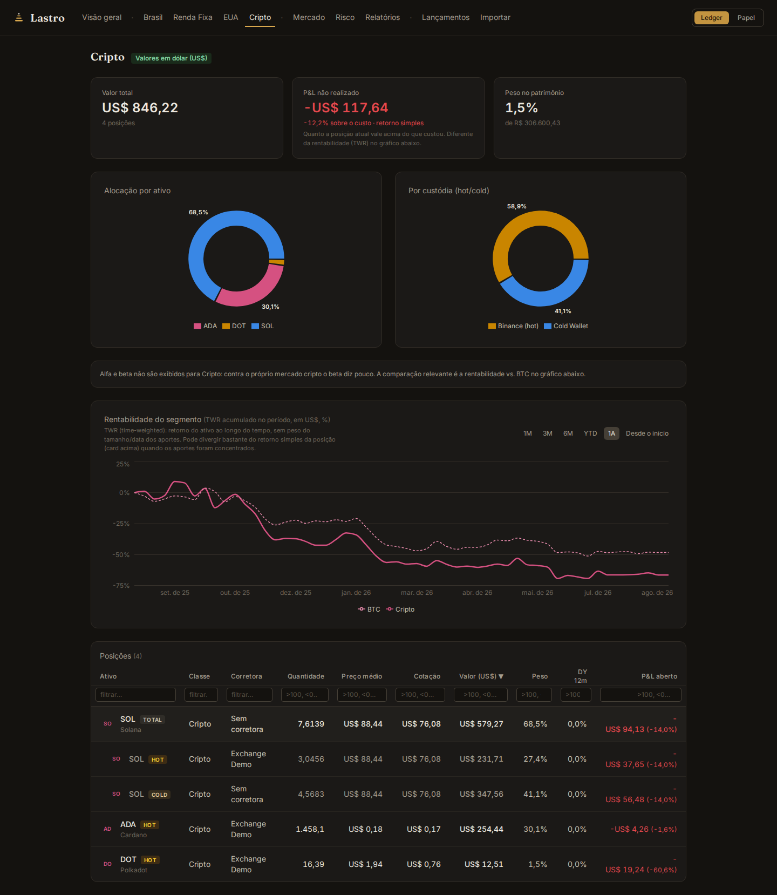
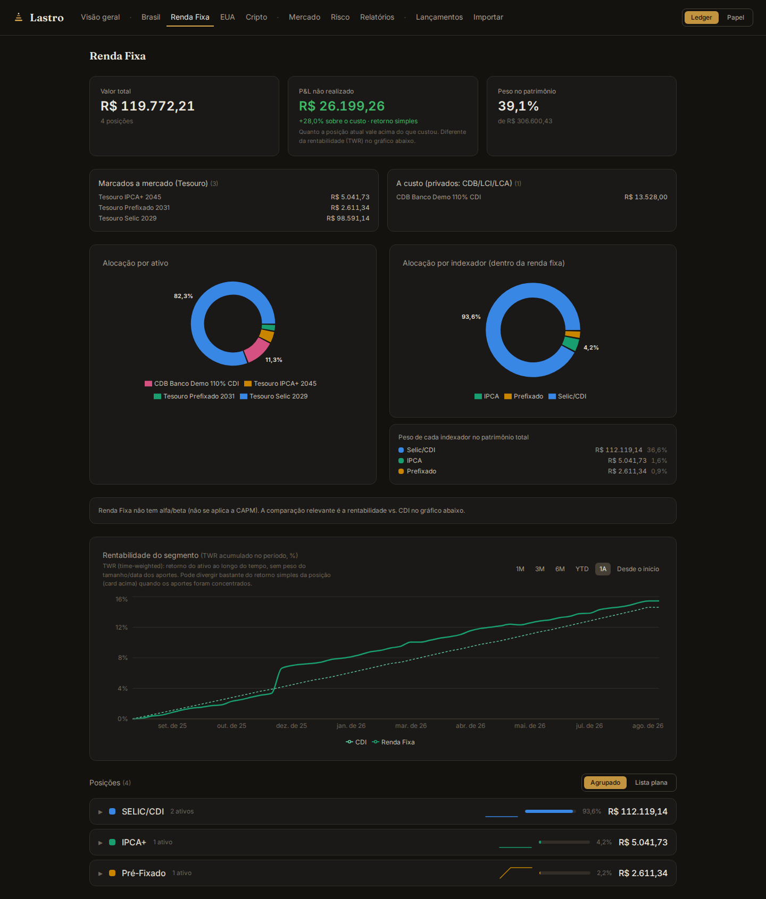
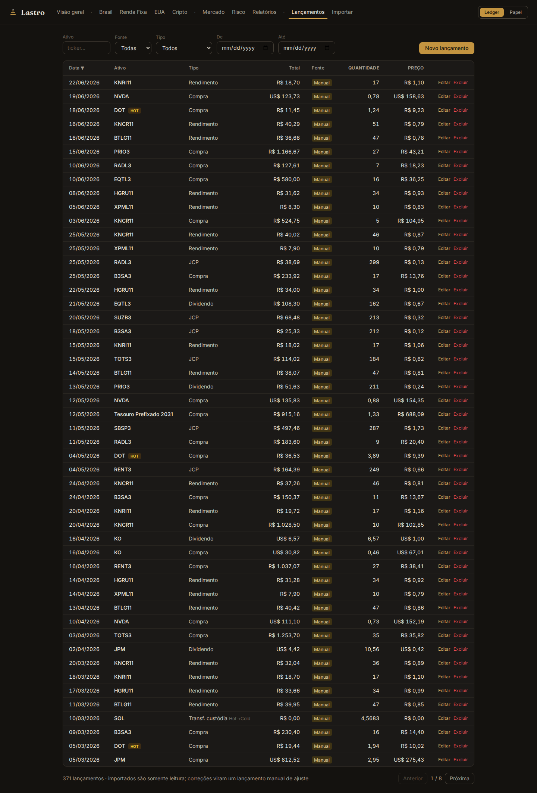
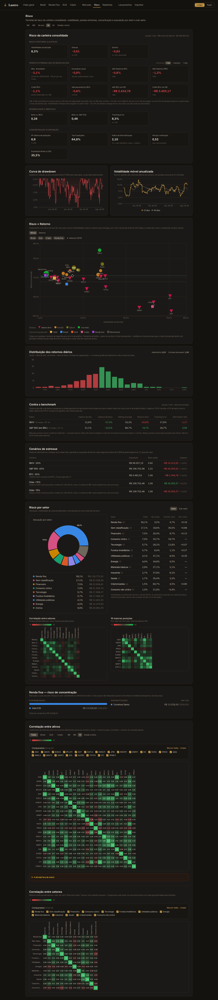
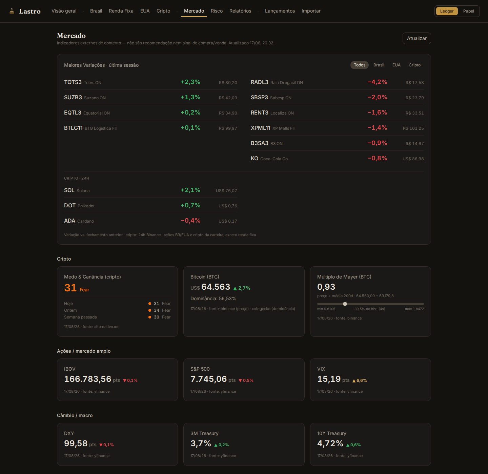
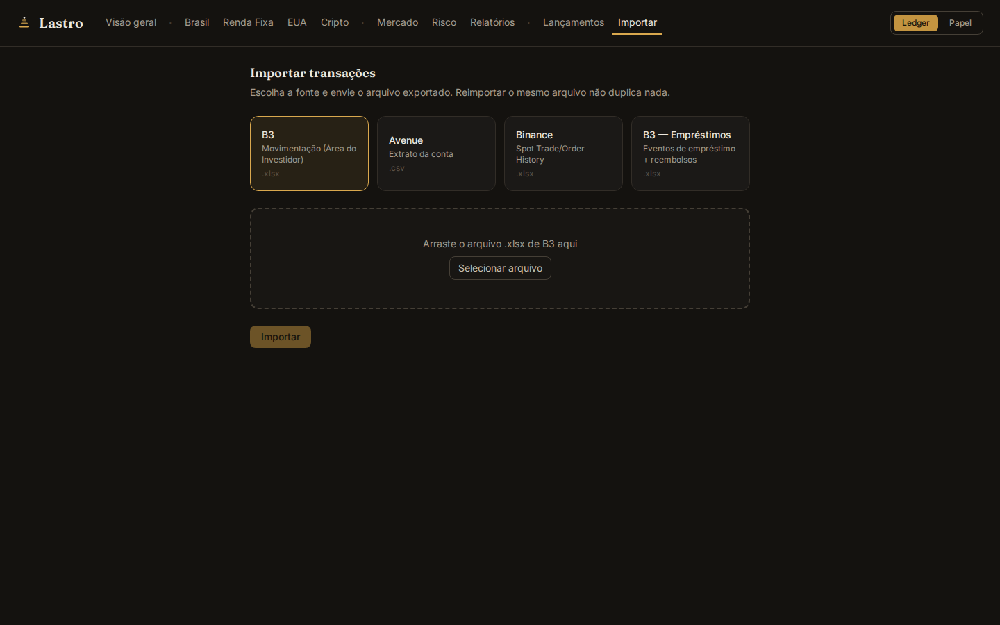
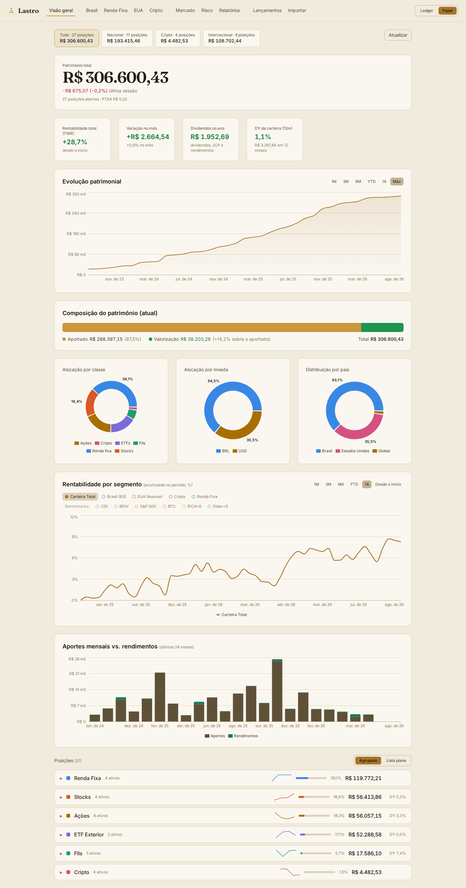

# Lastro — plataforma pessoal de consolidação de investimentos

> **⚠️ Todos os dados exibidos neste repositório (screenshots, banco demo, script de
> carga) são fictícios e gerados por script.** Nenhuma transação, posição ou valor
> aqui corresponde a uma carteira real. Este é um repositório-vitrine da versão demo;
> o histórico de desenvolvimento vive em um repositório privado.

Aplicação web **pessoal, single-user** que consolida investimentos de três fontes —
B3 (extrato de Movimentação), Avenue (extrato CSV) e Binance (exports de trade/order
history) — em um dashboard único: patrimônio consolidado em BRL, seções EUA e cripto
em USD nativo, renda (dividendos/JCP/rendimentos), dividend yield 12m por posição e
da carteira, TWR contra benchmarks (CDI, IBOV, S&P 500, BTC, IPCA+6 e Dólar+5), uma
seção de risco completa (volatilidade, VaR/CVaR, drawdown, betas, concentração,
correlação e um plano risco × retorno), CAPM e relatório mensal.

A ideia central é **automatizar a vida do investidor**: você arrasta o extrato
exportado da corretora/exchange e a plataforma calcula tudo sozinha — posições, preço
médio (nas convenções brasileiras, incluindo eventos corporativos e empréstimo de
ativos da B3), renda, curva de patrimônio e rentabilidade. Reimportar o mesmo arquivo
nunca duplica nada, cotações se atualizam sozinhas em background (COTAHIST diário para
B3, 5 em 5 minutos para EUA/cripto/Tesouro), e relatório mensal e backup são
automáticos. Zero digitação de transação no dia a dia; a entrada manual existe só para
ajustes e correções auditáveis.

| | |
|---|---|
| **Backend** | Python 3.12 · FastAPI · SQLAlchemy 2 · Pydantic v2 · Alembic · APScheduler |
| **Frontend** | React · TypeScript · Vite · Tailwind · Recharts |
| **Banco** | SQLite (schema compatível com PostgreSQL) |
| **Cotações** | COTAHIST/B3 (fechamento oficial) · yfinance · Binance REST · PTAX/Bacen · Tesouro Transparente |

## Screenshots (instância demo, dados sintéticos)

| Dashboard | Brasil |
|---|---|
|  |  |

| EUA (USD nativo) | Cripto (custódia hot/cold) |
|---|---|
|  |  |

| Renda Fixa | Lançamentos |
|---|---|
|  |  |

**Risco — terminal de risco da carteira consolidada:** volatilidade, Sharpe/Sortino,
drawdown (magnitude e duração), VaR/CVaR com seletor de horizonte (1 dia, 1 semana,
1 mês), betas, concentração, contribuição de risco por setor e cenários de estresse.
Um gráfico **Risco × Retorno** põe ativos, setores, segmentos, a carteira e os
benchmarks no mesmo plano volatilidade × retorno, e o bloco **contra o benchmark**
reporta captura de alta/baixa, batting average, retorno ativo, tracking error e
information ratio contra IBOV e S&P 500.



**Mercado — indicadores externos como contexto**, nunca como gatilho de compra/venda.



**Importar — o coração da automação:** arraste o arquivo exportado da fonte e pronto.



**Modo claro "Papel"** — toggle no header, tokens próprios calibrados para a nova
superfície (não um espelho mecânico do escuro), paleta de dados revalidada por script.



## Decisões técnicas de destaque

**Reconciliador de empréstimo de ativos B3.** O extrato de Movimentação da B3 mistura
pernas de custódia de empréstimo de ativos com negócios reais — uma devolução de
empréstimo precificada chega como `Transferência - Liquidação (Credito)` **com preço**,
indistinguível de uma compra. Sem tratamento, o preço médio replicado diverge do
gabarito da corretora. A solução (`app/services/lending.py`) colapsa eventos de
empréstimo em contratos (registro + linha de taxa dentro de uma janela de pareamento),
faz matching por (ticker, quantidade, ±3 dias) com no máximo uma perna por direção por
contrato, e descarta as pernas de custódia antes do import. Casos genuinamente
indecidíveis pelos arquivos viram warnings para adjudicação manual — fail-loud, nunca
heurística silenciosa.

**TWR com quebra a cada fluxo de caixa.** Retorno simples e Time-Weighted Return
divergem muito quando os aportes são concentrados; a plataforma calcula os dois e os
rotula honestamente (card de P&L = retorno simples; gráfico = TWR). O motor de TWR
(`app/services/history.py`) quebra o período a cada aporte/retirada e colapsa custódias
por ticker — o que torna transferências de custódia neutras no TWR por construção.

**Arquitetura de cotações em camadas.** Request paths nunca fazem fetch ao vivo: só o
scheduler busca cotações (EUA/cripto/Tesouro a cada 5 min; B3 uma vez ao dia pelo
arquivo COTAHIST oficial, com fallback D-1..D-5 e staleness por sessão em data de São
Paulo). Falha de fonte degrada para a última cotação com `stale=true` — cada fonte
falha de forma independente sem derrubar a tela. Séries históricas são "des-ajustadas"
de splits para casar com quantidades as-traded, com verificação antes de gravar.

**Idempotência de importação.** Todo import passa por
`import_hash = sha256(source|date|ticker|operation|quantity|unit_price|seq)`, onde
`seq` desambigua linhas legitimamente idênticas no mesmo arquivo (três dividendos
iguais no mesmo dia entram todos). Reimportar o mesmo extrato não duplica nada;
reclassificar um ativo e reimportar recria as linhas com a classe corrigida sem
duplicar. Linhas importadas nunca são editadas — correções são transações manuais
adicionais, auditáveis.

**Dinheiro nunca é float.** `Decimal` no Python, `NUMERIC` no banco, string no JSON,
`Intl.NumberFormat('pt-BR')` no frontend.

**Design system próprio, com paleta validada por script — em dois temas.** Identidade
"Ledger": dark quente (grafite, não o slate azulado default), latão como única cor de
marca (botões com texto escuro por contraste — 6,8:1), Inter para UI/dados e serifa de
display em exatamente três papéis (wordmark, número-herói, título de página). Cor é
sistêmica (`src/lib/colors.ts` é fonte única): a paleta categórica dos gráficos foi
**validada por script contra daltonismo** (separação protan/deutan ΔE ≥ 8 nos pares
adjacentes, contraste ≥ 3:1 sobre a superfície) — a ordem das cores é o mecanismo de
segurança, não estética. Verde/vermelho são reservados à semântica ganho/perda;
benchmarks tracejados usam a versão clara do matiz da seção que referenciam. O modo
claro "Papel" (toggle no header) **não é um espelho automático do escuro**: cada token
de texto/borda foi calibrado contra a nova superfície com a mesma tolerância de
contraste por papel que o escuro já usava, e a paleta categórica foi revalidada pelo
mesmo script contra o novo fundo (dois matizes precisaram escurecer para manter
contraste ≥ 3:1; os outros passaram sem ajuste). Os tokens compilam para CSS custom
properties reais (Tailwind v4) — a troca de tema não exige nenhuma mudança nos
componentes que os consomem.

**Dividend yield honesto entre moedas.** DY 12m = renda móvel de 12 meses ÷ valor de
mercado, **numerador e denominador na moeda nativa da posição** — o percentual vale
igual na visão BRL e na visão USD. Renda fixa não exibe DY por definição; grupos
agregam por média ponderada pelo valor de mercado.

**Cripto com custódia explícita.** O motor de posições indexa por `(ticker, custódia)`
— o mesmo ativo na exchange e em self-custody são posições distintas, movidas por uma
operação dedicada `custody_transfer` que preserva preço médio e não gera P&L.

**Tesouro Direto marcado a mercado** pela série de PU do CSV oficial do Tesouro
Transparente; renda fixa privada fica a custo com aviso na janela exibida.

**Seção Mercado: contexto, não gatilho.** Indicadores externos (Medo & Ganância,
preço/dominância do BTC, Múltiplo de Mayer, IBOV, S&P 500, VIX, DXY, Treasuries) com
uma regra editorial estrita: sem rótulo de compra/venda, sem "barato/caro" — cor
semântica só nas setas de variação. Cada fonte tem cache próprio e falha de forma
independente (mostra "—" sem derrubar a seção), com a fonte e a data sempre visíveis
no rodapé de cada card.

**Lista de posições: mesmo agrupador, dados ao vivo e históricos.** Cada cabeçalho de
grupo (Ações, FIIs, Renda Fixa por indexador...) mostra uma sparkline da tendência do
grupo nos últimos meses de snapshot — usando exatamente a mesma função de agrupamento
da visão ao vivo, aplicada aos dados históricos congelados (a assinatura foi estreitada
para o subconjunto de campos comum a ambos os formatos, sem duplicar lógica). Avatares
de ticker coloridos pela classe do ativo, cabeçalho fixo na lista plana e relatório
mensal com uma frase-resumo gerada dos dados já exibidos completam o conjunto.

**Seção de risco construída sobre séries já existentes.** O motor
(`app/services/risk.py`) não recalcula nada do zero: consome o índice de TWR diário da
carteira e as cotações históricas já cacheadas. Entrega volatilidade anualizada,
Sharpe/Sortino contra o CDI, curva de drawdown com **magnitude e duração** (pico-ao-fundo
do pior episódio e dias em queda desde o último pico — rastreados separadamente, porque
o drawdown atual nem sempre é o pior), VaR histórico 95/99, VaR paramétrico e CVaR,
assimetria/curtose, betas contra IBOV e S&P 500, tracking error, HHI por posição/
instituição/segmento e **índice de diversificação** (volatilidade média ponderada dos
grupos ÷ volatilidade real da carteira — revela a concentração por correlação que um
HHI por peso não enxerga).

Por setor e sub-setor, a **contribuição de risco vem de uma decomposição de Euler da
variância** (soma exata de 100% entre os grupos), ao lado da volatilidade da cesta
ponderada e da correlação média intragrupo. Cenários de estresse (IBOV/S&P 500 −20%,
BTC −30%, dólar ±15%) aplicam o choque à exposição real de cada segmento usando o beta
do CAPM quando existe — e dizem explicitamente quando não existe, ou quando a janela de
beta disponível é mais longa que a janela de risco selecionada. Nenhum número aparece
sem as premissas ao lado.

**Renda fixa entra pela lente certa.** Vale a distinção que a classe do ativo sozinha não
faz: Tesouro Direto é marcado a mercado e participa normalmente de volatilidade,
correlação e contribuição de risco; renda fixa privada fica a custo e **é excluída de todo
cálculo baseado em preço** — volatilidade ou VaR sobre um papel que não é remarcado seria
risco fabricado. Ela ganha uma lente própria: concentração por indexador e por emissor.

**Duas grades, cada uma com sua razão.** O que mede o *caminho* do retorno
(volatilidade, Sharpe, Sortino, tracking error, vol móvel) roda em **dias corridos,
anualizado por ×365**: descartar fim de semana perderia retorno real de cripto, que
negocia sete dias por semana. Já a distribuição de perda de **um dia** (VaR, CVaR, VaR
paramétrico, assimetria, curtose) roda em **dias de negociação**, porque "um dia" em
relatório de risco é pregão por convenção — misturar sábados parados dilui o quantil e
fabrica cauda gorda. As duas contagens aparecem lado a lado no cabeçalho da seção.

**Toda série de risco sai do motor de patrimônio, nunca de preço bruto.** Ler o
fechamento direto erraria três coisas ao mesmo tempo: ignoraria proventos (um FII pode
mudar de sinal na janela de 1 ano), misturaria BRL e USD no mesmo eixo, e leria um
desdobramento como queda de 80%. As cestas de setor e os pontos do gráfico risco ×
retorno consomem a série de TWR diário que o próprio motor calcula por ticker — em BRL,
com proventos como fluxo e desdobramento aplicado à quantidade.

**Correlação em três recortes.** Matriz de Pearson dos retornos diários entre ativos
(com filtro manual), entre setores/sub-setores (cestas ponderadas por valor) e um
recorte automático das 10 maiores posições — mais beta, alfa de Jensen e correlação por
segmento (CAPM). Tudo computado localmente a partir das séries em cache, sem chamada
externa no request path.

## Rodando a demo

```bash
# 1. Backend (porta 8001) com banco novo
cd backend
uv sync
export APP_DATABASE_URL="sqlite:///$PWD/demo.db"
uv run alembic upgrade head
uv run uvicorn app.main:app --port 8001

# 2. Dados sintéticos (em outro terminal)
cd backend
uv run python scripts/generate_demo_data.py --dry-run     # inspecionar
uv run python scripts/generate_demo_data.py               # carregar via API

# 3. Frontend (proxy apontando para a demo)
cd frontend
npm ci
API_PROXY_TARGET=http://localhost:8001 npx vite --port 5174
```

O scheduler busca cotações reais (COTAHIST, yfinance, Binance, PTAX) para os tickers
sintéticos na primeira execução — o dashboard fica "vivo" em 1–2 minutos.

## Estrutura

```
backend/
  app/
    api/          # routers FastAPI
    core/         # config (pydantic-settings), sessão de banco
    models/       # SQLAlchemy 2 (typed) + Alembic em ../alembic
    schemas/      # Pydantic v2
    parsers/      # um módulo por fonte: cei.py, avenue.py, binance.py
    services/     # portfolio engine, quotes, fx, lending, TWR, relatórios
    jobs/         # APScheduler (cotações, snapshot mensal, backup)
  scripts/
    generate_demo_data.py   # gerador dos dados fictícios desta demo
frontend/
  src/            # React + TS; client de API tipado em src/api
```

## O que ficou de fora da vitrine

A suíte de testes do projeto real (30+ arquivos, incluindo testes de parser contra
extratos reais) não acompanha esta demo justamente por depender dessas fixtures. Os parsers estão no código (`app/parsers/`) e a tela **Importar** funciona —
mas sem arquivos de extrato para alimentá-la, o caminho demonstrado aqui é a API de
transações manuais.
