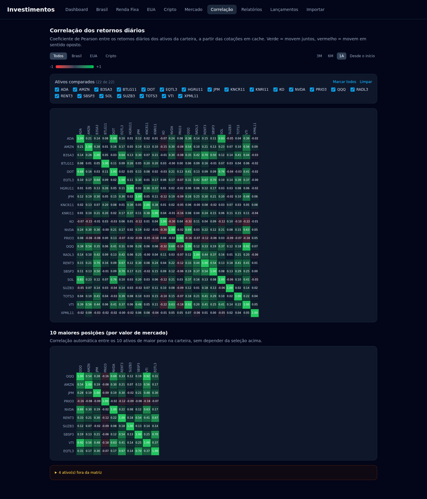

# Investimentos — plataforma pessoal de consolidação de investimentos

> **⚠️ Todos os dados exibidos neste repositório (screenshots, banco demo, script de
> carga) são fictícios e gerados por script.** Nenhuma transação, posição ou valor
> aqui corresponde a uma carteira real. Este é um repositório-vitrine da versão demo;
> o histórico de desenvolvimento vive em um repositório privado.

Aplicação web **pessoal, single-user** que consolida investimentos de três fontes —
B3 (extrato de Movimentação), Avenue (extrato CSV) e Binance (exports de trade/order
history) — em um dashboard único: patrimônio consolidado em BRL, seções EUA e cripto
em USD nativo, renda (dividendos/JCP/rendimentos), TWR contra benchmarks (CDI, IBOV,
S&P 500, BTC), correlação, CAPM e relatório mensal.

A ideia central é **automatizar a vida do investidor**: você arrasta o extrato
exportado da corretora/exchange e a plataforma calcula tudo sozinha — posições, preço
médio (nas convenções brasileiras, incluindo eventos corporativos e empréstimo de
ativos da B3), renda, curva de patrimônio e rentabilidade. Reimportar o mesmo arquivo
nunca duplica nada, cotações se atualizam sozinhas em background (COTAHIST diário para
B3, 5 em 5 minutos para EUA/cripto/Tesouro), e relatório mensal e backup são
automáticos. Zero digitação de transação no dia a dia; a entrada manual existe só para
ajustes e correções auditáveis.

| | |
|---|---|
| **Backend** | Python 3.12 · FastAPI · SQLAlchemy 2 · Pydantic v2 · Alembic · APScheduler |
| **Frontend** | React · TypeScript · Vite · Tailwind · Recharts |
| **Banco** | SQLite (schema compatível com PostgreSQL) |
| **Cotações** | COTAHIST/B3 (fechamento oficial) · yfinance · Binance REST · PTAX/Bacen · Tesouro Transparente |

## Screenshots (instância demo, dados sintéticos)

| Dashboard | Brasil |
|---|---|
|  |  |

| EUA (USD nativo) | Cripto (custódia hot/cold) |
|---|---|
|  |  |

| Renda Fixa | Lançamentos |
|---|---|
|  |  |

| Mercado (indicadores externos) | Correlação (matriz de Pearson) |
|---|---|
|  |  |

**Importar — o coração da automação:** arraste o arquivo exportado da fonte e pronto.


## Decisões técnicas de destaque

**Reconciliador de empréstimo de ativos B3.** O extrato de Movimentação da B3 mistura
pernas de custódia de empréstimo de ativos com negócios reais — uma devolução de
empréstimo precificada chega como `Transferência - Liquidação (Credito)` **com preço**,
indistinguível de uma compra. Sem tratamento, o preço médio replicado diverge do
gabarito da corretora. A solução (`app/services/lending.py`) colapsa eventos de
empréstimo em contratos (registro + linha de taxa dentro de uma janela de pareamento),
faz matching por (ticker, quantidade, ±3 dias) com no máximo uma perna por direção por
contrato, e descarta as pernas de custódia antes do import. Casos genuinamente
indecidíveis pelos arquivos viram warnings para adjudicação manual — fail-loud, nunca
heurística silenciosa.

**TWR com quebra a cada fluxo de caixa.** Retorno simples e Time-Weighted Return
divergem muito quando os aportes são concentrados; a plataforma calcula os dois e os
rotula honestamente (card de P&L = retorno simples; gráfico = TWR). O motor de TWR
(`app/services/history.py`) quebra o período a cada aporte/retirada e colapsa custódias
por ticker — o que torna transferências de custódia neutras no TWR por construção.

**Arquitetura de cotações em camadas.** Request paths nunca fazem fetch ao vivo: só o
scheduler busca cotações (EUA/cripto/Tesouro a cada 5 min; B3 uma vez ao dia pelo
arquivo COTAHIST oficial, com fallback D-1..D-5 e staleness por sessão em data de São
Paulo). Falha de fonte degrada para a última cotação com `stale=true` — cada fonte
falha de forma independente sem derrubar a tela. Séries históricas são "des-ajustadas"
de splits para casar com quantidades as-traded, com verificação antes de gravar.

**Idempotência de importação.** Todo import passa por
`import_hash = sha256(source|date|ticker|operation|quantity|unit_price|seq)`, onde
`seq` desambigua linhas legitimamente idênticas no mesmo arquivo (três dividendos
iguais no mesmo dia entram todos). Reimportar o mesmo extrato não duplica nada;
reclassificar um ativo e reimportar recria as linhas com a classe corrigida sem
duplicar. Linhas importadas nunca são editadas — correções são transações manuais
adicionais, auditáveis.

**Dinheiro nunca é float.** `Decimal` no Python, `NUMERIC` no banco, string no JSON,
`Intl.NumberFormat('pt-BR')` no frontend.

**Cripto com custódia explícita.** O motor de posições indexa por `(ticker, custódia)`
— o mesmo ativo na exchange e em self-custody são posições distintas, movidas por uma
operação dedicada `custody_transfer` que preserva preço médio e não gera P&L.

**Tesouro Direto marcado a mercado** pela série de PU do CSV oficial do Tesouro
Transparente; renda fixa privada fica a custo com aviso na janela exibida.

**Seção Mercado: contexto, não gatilho.** Indicadores externos (Medo & Ganância,
preço/dominância do BTC, Múltiplo de Mayer, IBOV, S&P 500, VIX, DXY, Treasuries) com
uma regra editorial estrita: sem rótulo de compra/venda, sem "barato/caro" — cor
semântica só nas setas de variação. Cada fonte tem cache próprio e falha de forma
independente (mostra "—" sem derrubar a seção), com a fonte e a data sempre visíveis
no rodapé de cada card.

**Correlação e CAPM sobre as cotações em cache.** Matriz de Pearson dos retornos
diários da carteira (com seleção de ativos e um recorte automático das 10 maiores
posições) e, por segmento, beta, alfa de Jensen e correlação contra o benchmark —
tudo computado localmente a partir das séries já cacheadas, sem chamadas externas
no request path.

## Rodando a demo

```bash
# 1. Backend (porta 8001) com banco novo
cd backend
uv sync
export APP_DATABASE_URL="sqlite:///$PWD/demo.db"
uv run alembic upgrade head
uv run uvicorn app.main:app --port 8001

# 2. Dados sintéticos (em outro terminal)
cd backend
uv run python scripts/generate_demo_data.py --dry-run     # inspecionar
uv run python scripts/generate_demo_data.py               # carregar via API

# 3. Frontend (proxy apontando para a demo)
cd frontend
npm ci
API_PROXY_TARGET=http://localhost:8001 npx vite --port 5174
```

O scheduler busca cotações reais (COTAHIST, yfinance, Binance, PTAX) para os tickers
sintéticos na primeira execução — o dashboard fica "vivo" em 1–2 minutos.

## Estrutura

```
backend/
  app/
    api/          # routers FastAPI
    core/         # config (pydantic-settings), sessão de banco
    models/       # SQLAlchemy 2 (typed) + Alembic em ../alembic
    schemas/      # Pydantic v2
    parsers/      # um módulo por fonte: cei.py, avenue.py, binance.py
    services/     # portfolio engine, quotes, fx, lending, TWR, relatórios
    jobs/         # APScheduler (cotações, snapshot mensal, backup)
  scripts/
    generate_demo_data.py   # gerador dos dados fictícios desta demo
frontend/
  src/            # React + TS; client de API tipado em src/api
```

## O que ficou de fora da vitrine

A suíte de testes do projeto real (30+ arquivos, incluindo testes de parser contra
extratos reais) não acompanha esta demo justamente por depender dessas fixtures. Os parsers estão no código (`app/parsers/`) e a tela **Importar** funciona —
mas sem arquivos de extrato para alimentá-la, o caminho demonstrado aqui é a API de
transações manuais.
